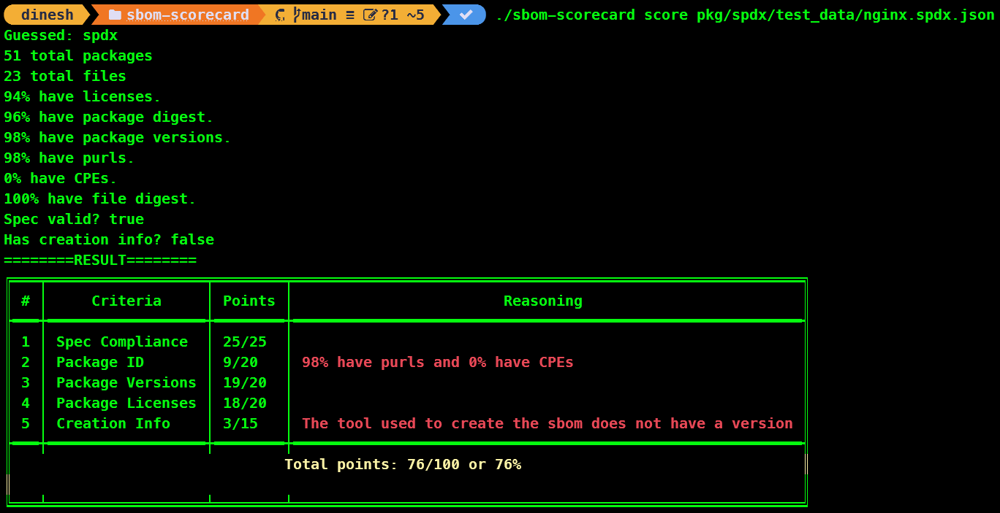

# 💥The authoritative source of this repository has moved to [justinabrahms/sbom-scorecard](https://github.com/justinabrahms/sbom-scorecard)💥

# SBOM Scorecard

[](https://www.repostatus.org/#wip)

When generating first-party SBOMs, it's hard to know if you're generating something good (e.g. rich metadata that you can query later) or not. This tool hopes to quantify what a well-generated SBOM looks like.

SPDX, CycloneDX and Syft are all in scope for this repo.




## Installation and Usage

1. Download the pre-compiled, platform-appropriate binary from
   the project's [releases page](https://github.com/eBay/sbom-scorecard/releases) and save it as `sbom-scorecard`.
2. Install it via go: `go install github.com/ebay/sbom-scorecard/cmd/sbom-scorecard@latest`
3. Run it from source: `git clone https://github.com/eBay/sbom-scorecard; alias sbom-scorecard="go run $PWD/cmd/sbom-scorecard/main.go"`

From there, you can score an SBOM with:

```
sbom-scorecard score examples/julia.spdx.json
```

We do our best to guess the right format, but you can specify it with:

```
sbom-scorecard score --sbomtype spdx examples/julia.spdx.json
```

For other options, run the help subcommand.

```
sbom-scorecard help
```

## Scoring.

Here are the metrics by which we score. This is evolving.

1. Is it a spec-compliant?
2. Does it have information about how it was generated?
   1. Does it have the software that was used?
   2. Do we know the version/sha of that software?
3. For the packages:
   1. Do they have ids defined (purls, etc)?
   2. Do they have versions and/or shas?
   3. Do they have licenses defined?

We weight these differently.

Spec compliance is weighted 25%.
Information about how an sbom was generated is worth 15%.
The remaining 60% is split across the packages who are direct dependencies.

### Examples

In this example, from the Julia project..

```
34 total packages
0 total files
100% have licenses.
0% have package digest.
0% have purls.
0% have CPEs.
0% have file digest.
Spec valid? true
```

This would result in:
| Criteria | Result | Points |
|-----------------|--------|--------|
| Spec compliant | true | 25/25 |
| Generation Info | N/A | 15/15 |
| Packages | | |
| ...IDs | 0% | 0/20 |
| ...versions | 0% | 0/20 |
| ...licenses | 100% | 20/20 |

So that's 60% (including the whole 15% because we don't have generation info implemented yet)

This example is from the dropwizard project:

```
167 total packages
79% have licenses.
100% have package digest.
100% have purls.
0% have CPEs.
Spec valid? true
```

This results in:
| Criteria | Result | Points |
|-----------------|--------------------|--------|
| Spec compliant | true | 25/25 |
| Generation Info | N/A | 15/15 |
| Packages | | |
| ...IDs | 50% (missing CPEs) | 10/20 |
| ...versions | 100% | 20/20 |
| ...licenses | 79% | 16/20 |

So that's 86% (including the 15% b/c generation info isn't implemented).

## Open Questions

1. Should package info really be split?
1. Should we break "license info" out as it's own top-level criteria?
